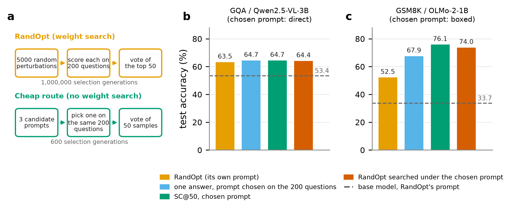
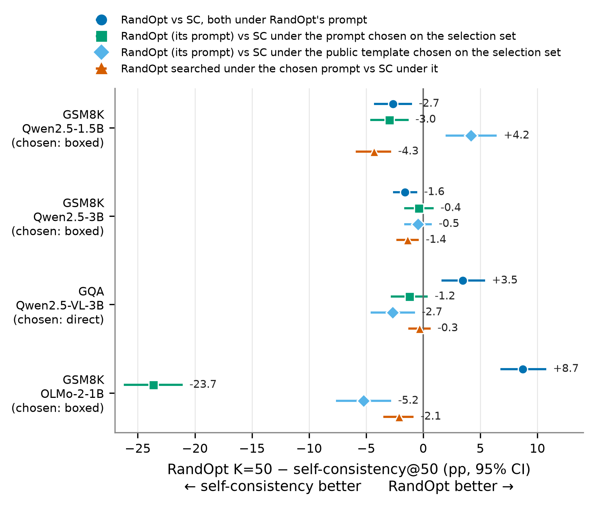

<div align="center">

# What Does Random Weight Search Buy?
### Votes, Prompts and First-Order Tilts in RandOpt

[](paper/latex/main.pdf)
[](paper/RESULTS_MASTER.md#r9-confirmatory-test-ledger-every-locked-test-with-its-outcome)
[](results/README.md)
[-8250df.svg)](https://arxiv.org/abs/2603.12228)
<br>
[](pyproject.toml)
[](scripts/pod_jobqueue.sh)
[](LICENSE)
[](LICENSE-CONTENT.md)

</div>

[Neural Thickets](https://arxiv.org/abs/2603.12228) (Gan & Isola, ICML 2026) introduced **RandOpt**: sample thousands
of Gaussian perturbations of a pretrained model's weights, keep the best on a 200-question selection set, and
majority-vote their answers. It reports gains that rival PPO and GRPO and reads them as evidence that task experts are
dense around pretrained weights.

We ask **what that weight search actually buys**, with same-run controls at RandOpt's own settings, every confirmatory
test locked in a commit before it ran.

## The answer

> RandOpt's gain is **a vote**, which sampling the unperturbed model supplies, plus **a shift in answers** that repairs
> damage done by RandOpt's own prompt. Choosing among a few prompts on RandOpt's own 200 selection questions
> (600 generations instead of 1,000,000) and then sampling **matches or beats RandOpt in all four rows** when a
> format-fixing prompt is among the candidates. With that prompt held fixed, **the search adds nothing in any row**,
> and what it selects is specific to the prompt it ran under.

<p align="center"></p>

## Results

**Four same-run rows** (N = 5000 perturbations, K = 50 vote; D = RandOpt − self-consistency@50, paired 95% CI):

| Row | Under RandOpt's prompt | vs SC under the prompt chosen on the selection set | RandOpt searched under that prompt |
|---|---|---|---|
| GSM8K · Qwen2.5-1.5B | −2.65 [−4.32, −0.99] SC ahead | −2.96 [−4.62, −1.29] SC ahead | −4.32 [−5.91, −2.81] SC ahead |
| GSM8K · Qwen2.5-3B | −1.59 [−2.65, −0.53] SC ahead | −0.38 [−1.67, +0.91] equivalent | −1.36 [−2.35, −0.38] SC ahead |
| GQA · Qwen2.5-VL-3B | **+3.47 [+1.62, +5.41] RandOpt ahead** (replicated +3.63) | −1.21 [−2.83, +0.40] no difference | −0.32 [−1.29, +0.65] equivalent |
| GSM8K · OLMo-2-1B | **+8.72 [+6.75, +10.77] RandOpt ahead** (replicated +10.39) | −23.65 [−26.23, −21.08] SC ahead | −2.12 [−3.49, −0.83] SC ahead |

- **Where RandOpt loses,** the selected models are barely better than the base model on their own (+4.0, +0.2): the
  gain is the vote, and sampling votes better.
- **Where RandOpt wins,** its own prompt damages the base model by 11.3 (GQA) and 31.6 (OLMo) points; the selected
  models (about +5 each) recover part of it. On GQA they mostly stop reasoning step by step and answer directly.
- **The condition, stated plainly.** With public evaluation templates only (lm-evaluation-harness, simple-evals,
  LLaVA, BLIP-2), prompt selection matches or beats RandOpt in three rows; on Qwen-1.5B no public template beats
  RandOpt's own prompt and **RandOpt is ahead (+4.17 [+1.97, +6.44])**. The cheap route needs a format-fixing
  candidate.

<p align="center"></p>

**What a perturbation does.** A first-order prediction from the base model's gradient and each perturbation's noise,
with **no fitted coefficients**, tracks how perturbations shift answer preferences: r = 0.938 and 0.915 (Qwen3-VL-8B,
two tasks), 0.925 (Qwen2.5-VL-7B), 0.930 per question in RandOpt's GQA setting, 0.790 / 0.787 on OLMo-2-1B / 7B
(ARC-Challenge). It lives in the middle language layers (block-level r = 0.978) and **fails where we say it fails**:
vision weights (r = 0.137), σ = 0.005, chain-of-thought correctness.

**Why selection finds shared shifts.** Under that law each question's margin moves by a Gaussian of width σ‖g‖, so
top-K selection is a noisy step along the selection set's gradient: it rewards shifts shared across questions. Across
ten searches, selection gains transfer to test only where the prompt leaves ≥ 10 points unclaimed, and the "experts"
found under one prompt are unrelated to those found under another (rank correlation 0.025 and 0.171; top-50 overlap 0).

## Verify the pre-registration yourself

Every confirmatory test has a `plan_lock.md` committed **before** its output existed. Any result can be checked
against its lock:

```bash
git log --diff-filter=A --format="%h %ad" -- results/paper-analysis/ps-prompt-selection/plan_lock.md   # lock first ...
git log --diff-filter=A --format="%h %ad" -- results/paper-analysis/ps-prompt-selection/PS_RESULT.md    # ... result after
```

[`paper/RESULTS_MASTER.md` §R9](paper/RESULTS_MASTER.md) lists all 71 locked tests with their rule and outcome,
including the falsified, inconclusive and gated-out ones; [`results/README.md`](results/README.md) maps each study to
its lock, result file and role in the paper.

## Repository map

```
paper/
  latex/main.tex             the paper (ICML 2026 template); main.pdf is the compiled draft
  RESULTS_MASTER.md          every number the paper may use, with its lock and source file; ledger (R9); theory (R11)
  STORY.md                   the argument: question, answer, claims, scope, reviewer questions
  WRITING_PROMPT.md          writing rules: what each result supports and what it does not
  figures/                   generated figures and tables, and the scripts that regenerate them
results/
  README.md                  index of every study
  paper-analysis/<study>/    plan_lock.md (pre-registration) · *_RESULT.md · pod/ (raw per-item outputs)
  perspective-taking-n5000-20261004/   raw scores of the original OmniSpatial search
scripts/                     GPU runners and locked CPU analyses (flat: locks cite these paths); see scripts/README.md
src/thicket_runtime/         verified weight-state handling used by the runners
tests/                       unit tests for perturbation folding and grouping
examples/                    frozen OmniSpatial item splits
```

## Reproduce

**Analyses and figures (CPU, Python ≥ 3.10):**

```bash
pip install -e '.[test]'
git clone https://github.com/sunrainyg/RandOpt third_party/RandOpt && git -C third_party/RandOpt checkout 4000d34
(cd third_party/RandOpt && python ../../scripts/c_prep_gsm8k.py)        # GSM8K in RandOpt's format
python paper/figures/scripts/thickets_or_tilts.py                        # figures and tables
python paper/figures/scripts/appendix_tables.py                          # appendix ledger, generated from RESULTS_MASTER
python scripts/ps_analysis.py --upstream third_party/RandOpt \
       --ps results/paper-analysis/ps-prompt-selection/pod/ps/out --out /tmp/ps.json   # the headline test
pytest -q
```

**Paper:** `cd paper/latex && latexmk -pdf main.tex` (the ICML 2026 style files are included).

**GPU runs** used rented H100 pods with a pinned stack (vLLM 0.11.0, transformers 4.57.1, torch 2.8.0).
`scripts/pod_jobqueue.sh <cap_usd> <model> <revision>` sets up a pod, enforces a hard spending cap and an idle stop,
and runs queued job scripts; each study's lock gives its exact commands. About $400 of GPU time in total.

> **GQA note.** RandOpt's released script cannot pass images to the model, so the GQA rows re-implement its loop on
> RandOpt's own perturbation, scoring and voting components, gated on fidelity to RandOpt's logs.

## Scope

Two tasks (GSM8K, GQA), models up to 8B, RandOpt's 200-question selection set, and a first-order account that covers
direct answers rather than chain-of-thought correctness. We do not claim that nearby better models are absent: they
are common (11.8–58.3% of perturbations beat the base model on the selection set). We claim that, at RandOpt's
settings, what selection recovers is what a prompt also recovers.

## Citation

```bibtex
@misc{yeluripati2026randomweightsearch,
  title  = {What Does Random Weight Search Buy? Votes, Prompts and First-Order Tilts in RandOpt},
  author = {Yeluripati, Karthik},
  year   = {2026},
  note   = {Under review},
  url    = {https://github.com/karthikyeluripati/thickets}
}
```

## Credit

This work re-examines [Neural Thickets / RandOpt](https://github.com/sunrainyg/RandOpt) (Gan & Isola, ICML 2026), whose
paper already separates format from reasoning gains. Related work we build on or credit:
[Cendra et al. (arXiv 2608.10867)](https://arxiv.org/abs/2608.10867) on Bayesian optimization over perturbations;
[*A Thicket by Any Other Name*](https://noxidog.substack.com/p/a-thicket-by-any-other-name) (Tervel Atanassov);
[*When does RandOpt work?*](https://kindxiaoming.github.io/blog/2026/randopt/) (Ziming Liu); self-consistency
(Wang et al., 2023).

<details>
<summary>Repository history</summary>

This repository began as a broader exploration (runtime profiling, adaptive evaluation, complementarity selection,
visual line-tracing, an "expert mirage" framing). Those directions were removed on 2026-10-07 and are preserved at tag
[`pre-cleanup`](../../tree/pre-cleanup). The OmniSpatial case-study notes and the standalone theory note are at
[`pre-cleanup-3`](../../tree/pre-cleanup-3) (older locks cite them by their original paths); operational logs removed
on 2026-10-09 are at [`pre-cleanup-2`](../../tree/pre-cleanup-2).
</details>
