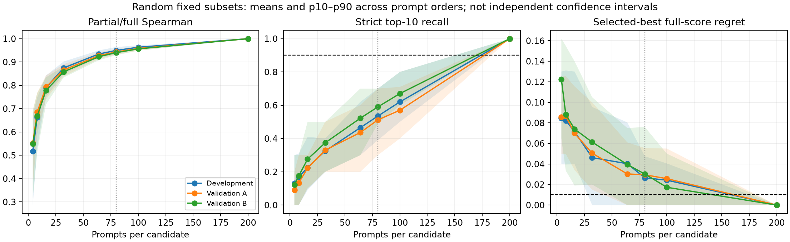
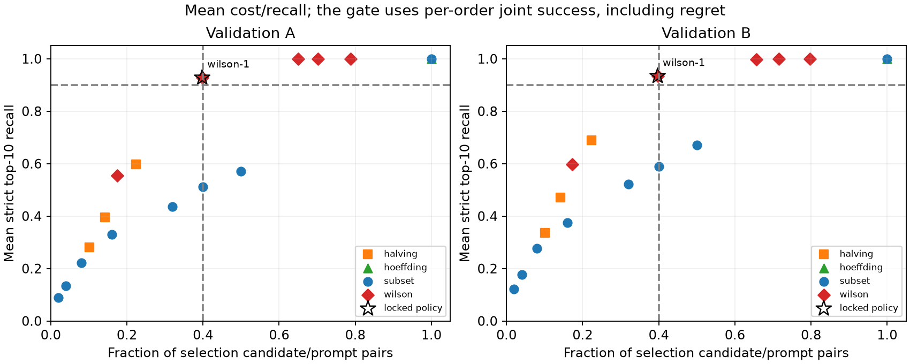
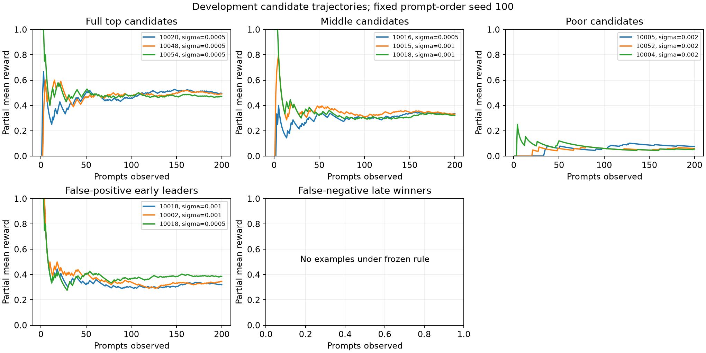

# Adaptive evaluation feasibility: frozen gate fails

**Decision: stop novel adaptive-evaluator development under the frozen criterion.**
Simple racing removes about 60% of selection pairs on average while retaining
about 93% of the top 10, but these averages conceal prompt-order failures. The
locked policy meets all three requirements on only 20/50 and 19/50 held-out
orders, versus the required 45/50 in each population. More conservative existing
racing supports roughly 34-35% pair reduction with strong retention. This is a
bounded negative result for the predeclared target, not evidence that all partial
evaluation is useless. No new algorithm, prompt selector, or kernel was built.

The [frozen protocol](ADAPTIVE_EVALUATION_PROTOCOL.md),
[raw and derived evidence](../results/adaptive-evaluation-20261003/),
[report tables](../results/adaptive-evaluation-20261003/report-tables.json), and
[independent accounting audit](../results/adaptive-evaluation-20261003/report-audit.json)
are preserved on `research/adaptive-evaluation-feasibility`.

## Experiment and separation of development from validation

We exhaustively collected **504 candidates x 200 GSM8K selection prompts**
(100,800 pairs), plus all candidates on 40 disjoint test prompts for ensemble
evaluation (20,160 additional pairs). All generated text, token IDs, rewards,
termination metadata, candidate recipes and weight fingerprints are retained.
The selection matrix contains 31,620,240 generated tokens. No partial evaluation
or outcome-dependent stopping occurred during collection.

Each population has 168 candidates: 56 seeds paired across sigma 0.0005, 0.001
and 0.002. Development uses seeds 10000-10055, validation A 20000-20055, and
validation B 30000-30055. Selection prompts are GSM8K train indices 32-231;
ensemble prompts are test indices 0-39. Development uses 20 frozen random prompt
orders; each validation population uses the same 50 new order seeds. These are
conditional order-sensitivity measurements, not independent statistical samples.

Collection uses one H100, Qwen2.5-0.5B BF16, TP=1, greedy eager Ray/vLLM, disabled
prefix caching and the original RandOpt snapshot worker with native packed-tensor
RNG semantics. The model revision is
`060db6499f32faf8b98477b0a26969ef7d8b9987`; upstream is
`4000d34fb5b69a3121cf1d2c564aa0be5a6a41ca`; measured source is
`0407e7ca588cb2f821f77323f0bca601c60d8857`. Worker, launcher, scorer, handler and
preprocessor blobs are verified. The maximum generation length is 512 tokens.

The 504-row sweep took 2,627.95 seconds (43.8 minutes), below the 90-minute bound.
Every restoration audit and all zero/repeat controls passed bitwise state and
output checks. Timings exclude correctness audits: mean apply/inference/restore/
score were 15.05 ms / 3.443 s / 12.26 ms / 8.28 ms per 240-prompt batch. Mean
lifecycle time was 3.478 s, with 0.785% in state handling. Peak allocated GPU
memory was 16,895,347,200 bytes. These are descriptive measurements from one
process, not an execution-speedup comparison.

The phase-4 development signal passed at 64 prompts. We then evaluated the
predeclared Wilson thresholds; none qualified for the final gate on development.
The frozen fallback rule selected `wilson-1` (z=1). The complete matrix and
[policy lock](../results/adaptive-evaluation-20261003/development/policy-lock.json)
were committed at `3e46097b915f69f993e15b5dbf686d1cbae22b32` **before validation
rows were parsed**. Validation enforces byte equality with the committed lock.
Other validation baselines are descriptive and cannot replace that policy.

## Findings

1. **Broad ranking becomes predictive well before the top 10 stabilizes.** At
   16 prompts, held-out mean Spearman is 0.78-0.79; at 32 it is 0.86-0.87; at 64
   it is 0.92-0.93. Pooled correlation partly reflects sigma separation: within
   each development sigma, 32-prompt correlation is only 0.56-0.65 and 64-prompt
   correlation 0.74-0.80. High overall correlation does not imply tail recovery.

2. **Small subsets recover few exact top candidates.** The following are means
   over 50 held-out orders, using a fixed candidate-ID hash to break all ties.

   | Prompts | Pair budget | Spearman A / B | Top-10 recall A / B |
   |---:|---:|---:|---:|
   | 4 | 2% | 0.552 / 0.549 | 9.0% / 12.2% |
   | 8 | 4% | 0.685 / 0.668 | 13.4% / 17.6% |
   | 16 | 8% | 0.793 / 0.778 | 22.2% / 27.6% |
   | 32 | 16% | 0.866 / 0.858 | 33.0% / 37.4% |
   | 64 | 32% | 0.927 / 0.923 | 43.6% / 52.2% |
   | 80 | 40% | 0.943 / 0.940 | 51.2% / 59.0% |
   | 100 | 50% | 0.958 / 0.956 | 57.0% / 67.0% |
   | 200 | 100% | 1.000 / 1.000 | 100% / 100% |

   The fixed 80-prompt prefix recovers 50% / 30%; it cannot qualify the gate.
   Full tables retain top-1/5/10/20, Jaccard, Kendall, tie-aware recall and errors.

3. **Aggressive elimination saves pairs but sacrifices experts.** Successive
   Halving starting at 4/8/16 prompts uses 10.10%/14.24%/22.36% of pairs. Its
   held-out top-10 recall is respectively 28.0-33.6%, 39.6-47.0%, and 59.8-69.0%.
   Union-bounded Hoeffding racing eliminates nobody early and uses 100%. The
   exploratory Wilson race trades retention against cost; its intervals are
   pointwise heuristics, not anytime confidence guarantees.

4. **The demonstrated removable cost depends on the quality requirement.** The
   locked z=1 race removes 60.21% / 60.29% of pairs and 60.37% / 60.34% of stored
   generation tokens on average, with 92.8% / 93.4% top-10 recall. It does not
   preserve that quality reliably enough. The predeclared z=1.64 baseline removes
   34.98% / 34.32% of pairs with 100% / 99.8% mean recall, zero best-score regret,
   and at least 90% recall on all 50 orders in each population. That is useful
   descriptive headroom for an existing policy, below the frozen 60% reduction
   target. These are offline selection-budget reductions, not wall-clock gains.

5. **The high-reward tail remains unstable.** At 32 prompts, a full top-10
   candidate lies outside partial top-20 on 48.2% / 41.8% of candidate-order
   observations, and outside top-50 on 14.8% / 11.0%. Even from 80 to 100 prompts,
   27.4% / 24.4% of top-10 membership changes on average; from 100 to 200 it is
   43% / 33%. Mean per-candidate score SD across orders falls from about 10
   percentage points at 16 prompts to 4.5 points at 64 and 3.2 at 100. Rankings
   are finite-benchmark references, not estimates known to be exact population
   accuracies. The fixed-rule trajectory figure has no late-winner example for
   development order 100; we retain that empty panel rather than select a more
   dramatic order.

6. **Rare correctness signals exist and can be lost.** Each held-out full top-10
   candidate solves 1-6 prompts solved by at most 10% of its population. For
   example, seed 20010/sigma 0.0005 alone solves train prompt 0184, in the final
   selection quartile. Random 32-/80-prompt subsets omit this candidate from
   their top 10 in 62%/42% of orders; the locked race eliminates it in 8%.
   Across held-out top candidates, the race's elimination frequency is 2-16%.
   The full records identify every rare/unique prompt and miss rate. This
   establishes a risk to complementary correctness, not a causal claim about
   semantic specialist categories or why a particular elimination occurred.

7. **Prompt informativeness is heterogeneous.** Seven selection prompts have
   zero reward variance in each population; others reach the binary maximum
   variance of 0.25. Validation has 49/50 nonconstant prompts solved by at most
   10% of candidates. Correlation with candidate scores excluding the prompt
   ranges from -0.267 to 0.705 in A and -0.197 to 0.635 in B. Per-prompt top-10
   enrichment, base correctness and variance are retained. No prompt allocation
   policy is trained from these diagnostics.

8. **Best-candidate quality is usually retained; ensemble equivalence is not
   established.** The locked race recovers the exact full best on 96% of orders
   in both populations. Mean full-score regret is 0.06 / 0.04 percentage points;
   worst regret is 1.5 / 1.0 points. Selected top-10 mean reward is 46.219% /
   45.794%, versus full-top-10 means 46.350% / 45.900%. On the 40 disjoint test
   prompts, upstream-style top-10 voting scores 37.5% / 47.5% for the full-selected
   sets and averages 37.0% / 46.15% for partial-selected sets. Individual orders
   range from 30-42.5% / 40-52.5%. A 40-prompt test has 2.5-point granularity;
   these dependent repetitions do not establish statistical equivalence.

9. **The frozen gate fails, including its robustness condition.** A successful
   order must use at most 40% of pairs, retain at least 90% of the strict top 10,
   and have at most one percentage point of best-score regret. The policy must
   succeed on at least 90% of development orders and separately on at least 90%
   of each validation population's orders.

   | Locked z=1 race | Development | Validation A | Validation B |
   |---|---:|---:|---:|
   | Mean pair fraction | 39.05% | 39.79% | 39.71% |
   | Mean strict top-10 recall | 93.5% | 92.8% | 93.4% |
   | Orders meeting cost | 55% | 50% | 50% |
   | Orders meeting recall | 85% | 86% | 86% |
   | Orders meeting regret | 100% | 96% | 100% |
   | Joint successes | 8/20 | 20/50 | 19/50 |

   Held-out pair fractions range from 31.3-46.8% / 29.6-53.4%; worst top-10 recall
   is 50% / 70%. Mean tie-aware recall rises to 94.6% / 95.6%, but does not change
   the primary gate. No validation-driven reselection or threshold change occurs.

10. **Stop the novel-method direction at this gate.** Existing racing demonstrates
    moderate savings and promising averages at the aggressive budget, but the
    requested reliable 60% reduction is not established. The result does not
    justify inventing a more complex evaluator to rescue this study.

## Figures, limitations and reproduction





This conclusion is conditional on one small model, a fixed prompt set, three
sigmas and 512-token decoding. Across populations, 13.3-13.9% of selection outputs
and 16.7-17.8% of test outputs hit the cap; upstream's default is 1024. Changing
the cap can change the reference ranking. Seeds are disjoint across populations,
but sigmas share seeds and every population shares prompts. Strict boundary ties
are resolved by an outcome-independent hash, with tie-aware diagnostics reported.

All oracle rewards came from complete 240-prompt batches. Actual partial batches
can change GPU scheduling and floating-point execution; their output invariance
and wall-clock costs were not measured. Repeated switching, selection overhead
and final ensemble cost are not included in offline selection-pair savings.
The policy receives only requested rewards. Saved prompt orders and per-candidate
counts encode its complete observation mask; the audit independently reconciles
all 2,064 traces' pair/token counts, top-10 recalls, regrets and joint outcomes.

The GPU source suite passed 58 tests with one intentional CPU-guard skip. The
local policy/analysis suite passed 68 with one CUDA-unavailable skip. All 516
previously indexed pilot, Work 1 and speculative-study files remain unchanged;
`main` remains at `deb414253139cc2559d19cdfe7e6b4786e7c40db`.

Exact invocation arrays, versions, raw commands, checksums and measured source
copies accompany the artifacts. GPU collection used PyTorch 2.8.0+cu128,
vLLM 0.10.2, Ray 2.49.2 and Transformers 4.56.2. Offline analysis used committed
source `7b0f642` through lock/validation commit `3e46097`; the later accounting
audit is separately recorded. Use new output paths when reproducing:

```bash
export PYTHONPATH="$PWD/src"
bash scripts/run_evaluation_matrix.sh /workspace/RandOpt results/new-adaptive/matrix-01
python scripts/analyze_adaptive_evaluation.py develop \
  --run results/new-adaptive/matrix-01 --upstream-root /workspace/RandOpt \
  --out results/new-adaptive/development
git add results/new-adaptive
git commit -m "Lock development selection before validation"
python scripts/analyze_adaptive_evaluation.py validate \
  --run results/new-adaptive/matrix-01 --upstream-root /workspace/RandOpt \
  --out results/new-adaptive/validation \
  --lock results/new-adaptive/development/policy-lock.json
python scripts/summarize_adaptive_evaluation.py \
  --run results/new-adaptive/matrix-01 --development results/new-adaptive/development \
  --validation results/new-adaptive/validation --out results/new-adaptive/report-tables.json
python scripts/plot_adaptive_evaluation.py \
  --run results/new-adaptive/matrix-01 --development results/new-adaptive/development \
  --validation results/new-adaptive/validation --out results/new-adaptive/figures
python scripts/audit_adaptive_evaluation.py \
  --root results/new-adaptive --out results/new-adaptive/report-audit.json
python scripts/finalize_adaptive_evidence.py --root results/new-adaptive
```
