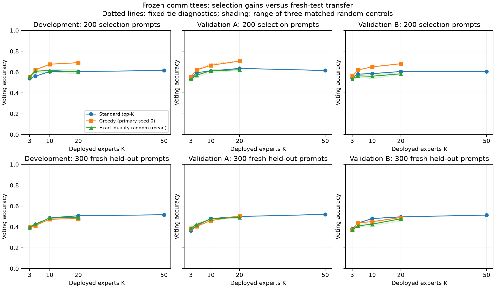

# Complementarity selection: NO-GO, direction closed

**Does RandOpt leave measurable ensemble quality or deployment efficiency on the
table because it selects experts by individual reward rather than committee
complementarity?** **No under this frozen feasibility test.** Greedy selection
substantially improves its 200-prompt selection objective, but those gains do not
transfer reliably to 300 fresh prompts. Neither frozen success condition passes
both validation populations. The direction stops here.

Exactly two experiments were performed: offline selection on the existing matrix,
then one H100 evaluation of the precommitted 232-expert union. Candidate generation
and search are unchanged; the old 504-candidate matrix was not regenerated. See
the [frozen protocol](COMPLEMENTARITY_PROTOCOL.md),
[machine-readable gate](../results/complementarity-selection-20261003/analysis/gate.json),
and [complete derived tables](../results/complementarity-selection-20261003/tables/tables.md).

## Selection gains versus fresh-test performance

Accuracies are percentages. S = standard individual-score top-K; G = primary
greedy, tie seed 0. Deltas are absolute percentage points. Greedy K=50 was
selection-only, as frozen before GPU execution.

| Population | K | Selection S / G | Fresh S / G | Selection gain -> fresh gain |
|---|---:|---:|---:|---:|
| Development | 3 | 54.00 / 55.50 | 39.00 / 39.67 | +1.50 -> +0.67 |
| Development | 5 | 56.00 / 62.00 | 42.33 / 41.33 | +6.00 -> -1.00 |
| Development | 10 | 60.50 / 67.50 | 48.67 / 47.33 | +7.00 -> -1.33 |
| Development | 20 | 60.50 / 69.00 | 50.67 / 48.00 | +8.50 -> -2.67 |
| Development | 50 | 61.50 / 70.00 | 51.67 / not collected | +8.50 -> not collected |
| Validation A | 3 | 53.50 / 55.50 | 36.33 / 38.67 | +2.00 -> +2.33 |
| Validation A | 5 | 59.50 / 62.00 | 41.33 / 40.67 | +2.50 -> -0.67 |
| Validation A | 10 | 61.00 / 66.50 | 48.00 / 46.00 | +5.50 -> -2.00 |
| Validation A | 20 | 63.50 / 70.50 | 50.00 / 50.67 | +7.00 -> +0.67 |
| Validation A | 50 | 61.50 / 70.00 | 52.00 / not collected | +8.50 -> not collected |
| Validation B | 3 | 54.50 / 56.50 | 38.00 / 37.00 | +2.00 -> -1.00 |
| Validation B | 5 | 58.00 / 62.00 | 43.67 / 44.00 | +4.00 -> +0.33 |
| Validation B | 10 | 58.50 / 65.00 | 48.00 / 45.00 | +6.50 -> -3.00 |
| Validation B | 20 | 60.50 / 68.00 | 49.67 / 49.00 | +7.50 -> -0.67 |
| Validation B | 50 | 60.50 / 70.00 | 51.33 / not collected | +9.50 -> not collected |

This is **selection-set overfitting**. K=10 gains +5.50/+6.50 points during
selection but loses 2.00/3.00 points on validation A/B. At K=20, selection gains
of +7.00/+7.50 shrink to +0.67/-0.67. A's K=3 gain exceeds two points, but B
loses one point; development never qualifies the gate.



## Frozen gate and deployment cost

No greedy 5-10-expert committee matches standard 20-50 within the allowed one
point on both validation populations. All four comparisons fail:

| Greedy / standard K | A fresh delta | B fresh delta | Expert-pass ratio | Exact pass reduction |
|---|---:|---:|---:|---:|
| 5 / 20 | -9.33 pp | -5.67 pp | 4x | 75% |
| 5 / 50 | -11.33 pp | -7.33 pp | 10x | 90% |
| 10 / 20 | -4.00 pp | -4.67 pp | 2x | 50% |
| 10 / 50 | -6.00 pp | -6.33 pp | 5x | 80% |

These are potential logical reductions with unacceptable measured quality loss,
not achieved equal-quality savings or wall-clock speedups. Ordinary standard
10 also misses standard 20 by 2.00/1.67 points; complementarity makes that
comparison worse. No same-K comparison reaches +2 points on both A/B.

For a full 300-question evaluation, K is both the unique expert count and the
number of generation RPCs; request sequences total 300K. Exact token costs are:

| Committee | Experts / RPCs | Request sequences | A generated tokens | B generated tokens |
|---|---:|---:|---:|---:|
| Greedy 5 | 5 | 1,500 | 481,032 | 483,880 |
| Greedy 10 | 10 | 3,000 | 998,719 | 987,477 |
| Standard 20 | 20 | 6,000 | 1,889,772 | 1,906,861 |
| Standard 50 | 50 | 15,000 | 4,747,187 | 4,753,302 |

Greedy 10 uses 47.15%/48.21% fewer tokens than standard 20 and 78.96%/79.23%
fewer than standard 50, with the losses above. Counts for every committee,
including K=3 and same-K baselines, are in the complete tables.

## Diversity, matched controls, and uncertainty

Lower error correlation does not compensate for weaker experts. At K=10:

| Population / method | Mean individual fresh accuracy | Mean error correlation | Answer disagreement | Both experts wrong |
|---|---:|---:|---:|---:|
| A standard | 35.57% | 0.467 | 66.28% | 52.20% |
| A greedy | 32.63% | 0.398 | 73.25% | 54.03% |
| B standard | 35.57% | 0.466 | 66.48% | 52.10% |
| B greedy | 24.57% | 0.277 | 84.21% | 61.74% |

The more diverse committees have more jointly wrong answers. Greedy/top-K
overlap at K=3/5/10/20 is 2/2/3/4 experts for A and 2/2/4/5 for B. K=10 mean
winning margins fall from 3.52 to 2.95 votes in A and 3.43 to 2.09 in B;
ties rise from 13.33% to 16.67% and 17.67% to 23.33%. Every question's votes,
margin and correctness, full individual score distributions, and every pairwise
error/disagreement record are in
[`committee-details.json.gz`](../results/complementarity-selection-20261003/analysis/committee-details.json.gz).

Random seeds 101/102/103 match greedy's **exact individual selection-score multiset
at every K**, without optimizing error diversity. Their K=10 fresh accuracies
range from 46.67-48.33% in A versus greedy's 46.00%, and 41.33-44.67% in B versus
greedy's 45.00%; standard is 48.00% in both. Greedy can beat these weaker-quality
controls in B, but does not improve over standard ranking. At K=20, random
ranges are 48.33-50.33% in A and 45.33-49.33% in B, versus greedy's 50.67%/49.00%.
Score-group sizes and actual control diversity are recorded; singleton groups
constrain some positions.

Diagnostic tie seeds 1/2 also fail. They leave development and B committees
unchanged through K=20; in A both yield 48.00% at K=10 and 49.67% at K=20.
They are sensitivity checks, not independent replications or replacement methods.

Paired question-bootstrap intervals are descriptive, not an additional gate.
For greedy 10 versus standard 20, 95% intervals are [-8.33, +0.33] pp in A and
[-9.00, -0.33] pp in B. Every same-K interval includes zero. This closes the
predeclared feasibility decision, without proving universal absence of a benefit.
Scope is one model, 300 fixed questions shared across populations, three candidate
populations with dependent sigma variants, and a 512-token cap. The union cap
rate is 11.91%; upstream's 1024-token default was not tested. No further tuning
or experiment is performed.

## Execution and preserved evidence

The rule, thresholds, seeds and inputs were frozen at `8ebae53`; committees and
the union at `af4823c`, before new generations. Measured GPU source is
`cde664b461cf455338e1138ec24beced111ffee0`; final analysis code is `08fdc42`.
[Selection artifacts](../results/complementarity-selection-20261003/offline/)
contain exact committees, candidate IDs/fingerprints and construction histories.
The optional lambda variant was omitted in the frozen protocol.

Fresh official GSM8K main/test indices **40-339** use dataset revision
`740312add88f781978c0658806c59bc2815b9866`, with no overlap against earlier
formatted inputs. JSONL SHA256:
`acc0c407b6377bced91c72604b709df22afa363bceb79c42a8c485cecdbfd239`.
The old 40 test prompts were not used for selection or this evaluation.

The H100 run uses Qwen2.5-0.5B revision
`060db6499f32faf8b98477b0a26969ef7d8b9987`, BF16, TP=1, greedy eager Ray/vLLM,
and original RandOpt worker commit
`4000d34fb5b69a3121cf1d2c564aa0be5a6a41ca` with exact snapshot anchoring.
PyTorch 2.8.0+cu128, vLLM 0.10.2, Ray 2.49.2 and Transformers 4.56.2 match the
previous study. Native packed base ID is
`991345c343a27a7aa28528a633c876aa4a0ea7d52f3f6291d6240702058e622f`.
Prefix caching is disabled; requests drain before weight changes. Extraction,
nonempty-answer Counter voting with insertion-order ties, and scoring use the
pinned upstream semantics.

All 232 fingerprints matched the old matrix **before generation**, all restores
were exact, and zero/base/candidate repeat controls passed. Collection required
69,600 request sequences and **22,029,830 generated tokens**; six control RPCs
added 1,800 sequences and 561,212 tokens. Candidate collection took 1,580.27 seconds,
including audits and artifact work. Peak PyTorch allocation was 16,895,347,200
bytes; peak reservation was 17,553,162,240 bytes. These are descriptive collection
costs. Cleanup left 0 MiB GPU usage.

The GPU suite passed **74 tests**, with one CPU-only guard skipped. Analysis
verified every GPU checksum, rescored all generations, reproduced selection votes
and checked complete union coverage. A report-only NumPy boolean serialization
fix passed seven targeted tests. The incomplete analysis is preserved; its
summary and compressed vote details are byte-identical to the completed analysis.
No GPU run or scientific rule changed.

Environment, exact commands, measured source, raw generations, controls, transport
hash and analysis manifests are under
[`results/complementarity-selection-20261003`](../results/complementarity-selection-20261003/).
The historical unavailable-pod preflight remains archived. Final integrity and
checksum indexes verify old artifacts, measured source and frozen inputs.

## Reproduction

Use new output paths: existing runs are immutable. Original provisioning/run
commands and dependency arguments are in
[`execution-notes.json`](../results/complementarity-selection-20261003/execution-notes.json).
With the recorded environment and pinned upstream checkout:

```bash
export PYTHONPATH="$PWD/src"
bash scripts/run_committee_validation.sh /workspace/RandOpt-feasibility \
  results/complementarity-selection-20261003/offline runs/committee-reproduction
python scripts/analyze_complementarity.py \
  --upstream-root /workspace/RandOpt-feasibility \
  --selection results/complementarity-selection-20261003/offline \
  --run runs/committee-reproduction --out runs/committee-reproduction-analysis
```

Completed evidence is committed on `research/complementarity-selection-feasibility`.
Prior artifacts and `main` are preserved. **NO-GO: complementarity-aware selection
is closed under the frozen gate.**
