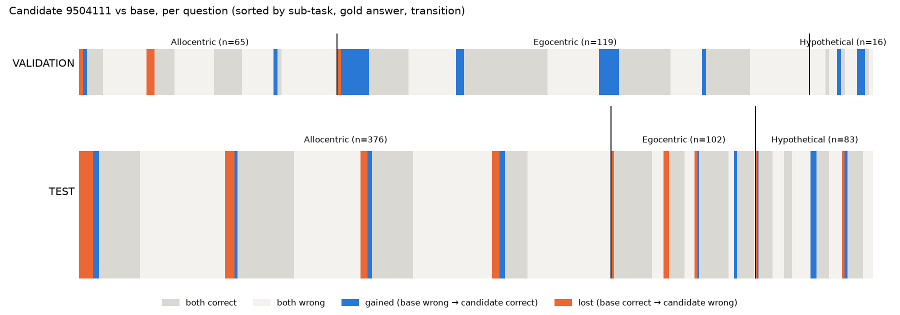

# Perspective-Taking N=5,000: forensic audit

Audit started from commit `b80f4d3`, on branch `research/perspective-taking-forensic-audit`.

- **New artifacts:** everything this audit wrote is in [`results/perspective-taking-n5000-20261004/forensic-audit/`](../results/perspective-taking-n5000-20261004/forensic-audit/),
  produced by [`scripts/forensic_audit_perspective.py`](../scripts/forensic_audit_perspective.py)
  (static Phases A–P) and [`scripts/forensic_repro_perspective.py`](../scripts/forensic_repro_perspective.py)
  (GPU Phases Q–R).
- **Independence:** the static auditor imports nothing from the study code.
- **Existing files:** none was modified.

| Audit question | Result |
|---|---|
| Independent scorer reproduces +8 validation? | **Yes**: 79 → 95 / 200 |
| Independent scorer reproduces −2.67 test? | **Yes**: 259 → 244 / 561 |
| Same candidate weights across phases? | **Yes**: one recipe, one candidate ID and one state fingerprint (`7f0bdb3b…`) from manifest through search, validation and test |
| Split leakage? | **No**: no shared QA, image, image hash or question text between train-side splits and test |
| Duplicate images across splits? | **No**: 0 shared image hashes, and no duplicates within splits |
| Answer-distribution shift? | **No**: true-letter mix is not different (TVD 0.055, p = 0.60) |
| Subtask-distribution shift? | **Yes, large**: Egocentric 59.5% vs 18.2%; TVD 0.41, p ≈ 0 |
| σ=0.002 directional answer bias? | **Yes**: a shared shift that flips the same borderline validation questions across random candidates (detail in Phase N) |
| Vision encoder definitely recomputed each candidate? | **Yes**, by code path (vLLM 0.11.0) and by per-call runtime hook counts |
| vLLM definitely consumed updated weights? | **Yes**: eager mode, compilation level 0, in-place parameters with no derived copies; outputs change with σ and reproduce exactly |
| Candidate ranking reconstructed independently? | **Yes**: the full 5,000 ranking, top 50 and validation top 10 are identical |
| Clean-process reproduction matches? | **Yes**: identical raw text on every question for base, 9504111 (twice) and 4 other candidates |
| Concrete bug found? | **No** |
| Final classification | **`RESULT_REPRODUCED_SPLIT_SPECIFIC_EFFECT`** |

> **The +8 pp occurred because** σ = 0.002 perturbations systematically tip a
> small set of borderline, templated *Egocentric* validation questions to the
> right answer. These are mostly "suppose you are in the …" items where the base
> model sits on a decision boundary. Some single questions are flipped by ~80% of
> *random* σ = 0.002 candidates. Seed 9504111 is the maximum of that shared shift
> plus candidate-specific luck. It was selected out of 50 search winners, and it
> had itself entered the top 50 through a 33-way search tie. Ninety percent of
> its net gain is Egocentric, the type that makes up 60% of VALIDATION200 but
> only 18% of the official test, and that test's Egocentric questions are a
> different, easier kind. On the test, which is two-thirds Allocentric with
> almost no template overlap, the same perturbation costs 14 net Allocentric
> answers, giving −2.67 pp.

## Phase A: independent reconstruction

From raw generations, the auditor re-parsed every response with its own
implementation of the frozen first-character rule and re-hashed every image from
the original PNG files.

| | Base | Candidate 9504111 | Gain |
|---|---:|---:|---:|
| SEARCH200 | 72 | 77 | +2.5 pp |
| VALIDATION200 | 79 | **95** | **+8.0 pp** |
| TEST561 | 259 | **244** | **−2.67 pp** |

All four reported numbers reproduce. The independent and original scorers
disagree on 0 of 1,922 per-question decisions. Base and candidate saw
byte-identical prompt tokens on every question. The per-question table is
[`phaseA_per_question.csv`](../results/perspective-taking-n5000-20261004/forensic-audit/phaseA_per_question.csv).

## Phase B: where the +16 net validation answers came from

| VALIDATION200 | Gained | Lost | Net |
|---|---:|---:|---:|
| **Egocentric (119)** | 15 | 1 | **+14** |
| Hypothetical (16) | 3 | 0 | +3 |
| Allocentric (65) | 2 | 3 | −1 |
| **Total** | **20** | **4** | **+16** |

Of 200 validation questions, 101 are wrong for both models and 75 are right for
both. The net gain spreads over true letters A, C and D (+6, +6, +4). On the base
side, gains come mostly from questions where the base answered B (+7) or C (+6).

By question template, "suppose you are in the …" (14 items) gives +6 net. The
"taking the camera lens as …" template (21 items) gives −3. On TEST561 the same
candidate gains 23 and loses 38 (net −15):

| TEST561 | Net |
|---|---:|
| **Allocentric (376)** | **−14** |
| Egocentric (102) | −5 |
| Hypothetical (83) | +4 |

The losses spread over gold letters A and B (−8, −9). The worst templates are
"from the photographer's perspective" (−4) and "from the perspective of the"
(−3).

The per-question transition files are
[`candidate_9504111_validation_transitions.csv`](../results/perspective-taking-n5000-20261004/forensic-audit/candidate_9504111_validation_transitions.csv)
and the corresponding test file. In the per-question plot, validation gains
cluster inside Egocentric answer blocks, while test losses run through every
Allocentric block:

## Phase C: the splits are different distributions

| | SEARCH | VALIDATION | TEST |
|---|---:|---:|---:|
| QA pairs / unique images | 200 / 200 | 200 / 200 | 561 / 561 |
| Allocentric / Egocentric / Hypothetical | 65 / 119 / 16 | 65 / 119 / 16 | 376 / 102 / 83 |
| True A / B / C / D | 51 / 56 / 46 / 47 | 51 / 56 / 46 / 47 | 160 / 137 / 143 / 121 |
| Base accuracy: Allocentric / Egocentric / Hypothetical | 33.8 / 38.7 / 25.0% | 30.8 / 47.1 / 18.8% | 37.5 / **77.5** / 47.0% |
| Median image size | 0.27 MP | 0.29 MP | **0.96 MP** |
| Distinct question templates | 51 | 62 | 381 |

The two train-derived splits are identical in sub-task and answer mix by
construction. They also share recurring templated questions: 26 identical
question texts, each on a different image.

| Comparison | Sub-task TVD | Sub-task × answer TVD | Template TVD | Shared templates |
|---|---:|---:|---:|---:|
| SEARCH vs VALIDATION | 0.00 | 0.00 | 0.34 | 27 |
| VALIDATION vs TEST | 0.41 (p ≈ 0) | 0.41 (p ≈ 0) | **0.96** | 4 |

Only 22 of the 561 test questions use a template seen in validation. "Egocentric"
in official train means relational viewpoint questions. In official test it is
dominated by easier counting and direction questions, where the base already
scores 77.5%.

## Phase D: duplicates and leakage

**Disjointness:**

| Check | Count |
|---|---:|
| Exact duplicate QA records across the three splits | 0 |
| Duplicate instance IDs | 0 |
| Shared image hashes, any pair of splits | 0 |
| Shared instance IDs, any pair of splits | 0 |
| Shared question texts, SEARCH vs TEST and VALIDATION vs TEST | 0 |

**Full official Perspective-Taking data:**

| Check | Count |
|---|---:|
| Train / test records | 3,079 / 561 |
| Shared image hashes, train vs test | 0 |
| Shared question texts, train vs test | 0 |
| Train images with multiple questions | 996 |
| Byte-identical duplicate image files | 0 |

**Within train.** There is no QA or image leakage, but templating is real. 277
train question texts recur on different images, and SEARCH and VALIDATION share
26 question texts. Selecting on one 200-question train split therefore rewards
behaviour on recurring templates. Those templates are almost absent from test.

## Phase E: candidate identity

The provenance chain for seed 9504111:

| Step | Evidence |
|---|---|
| Manifest | index 4111, so seed 9500000 + 4111 = 9504111, σ = mixture[4111 mod 4] = 0.002, shard 41 |
| Candidate ID | `25a60f0b…` recomputed from first principles |
| Search | shard 041 file: 77/200, search rank 40 |
| Top 50 | position 40 |
| Validation | shard 01 file, with fingerprint checked before generation: 95/200 |
| Validation lock | rank 1, state `7f0bdb3b…` |
| Test | file with fingerprint checked before generation: 244/561 |

**Consistency checks:**

- **Identity:** one state fingerprint and one candidate ID everywhere. The seed
  is an integer and σ an exact float in every record.
- **Restoration:** bitwise exact in every phase.
- **All 76 phase directories agree** on base fingerprint (tree and flat),
  parameter layout and mask, `PERTURB_VISUAL=1`, model, processor and tokenizer
  revision, dtype and package versions.
- **Population:** all 5,000 search records recompute their candidate ID and
  shard from the manifest with zero mismatches.
- **Ruled out:** off-by-one or shard-offset errors, misattributed retries and
  stale states.

## Phase F: perturbation mask

The pinned worker `4000d34` perturbs a parameter when `PERTURB_VISUAL=1` is set
in the worker process, or when the parameter name doesn't start with `visual.`.
Our engine runs the worker in-process with that variable set, and every phase
recorded `all_parameters_perturbed = True`.

| Group | Tensors | Parameters |
|---|---:|---:|
| All (BF16) | 642 | 8,767,123,696 |
| Visual (`visual.*`) | 351 | 576,388,336 |
| Language and other | 291 | — |

All 642 tensors were perturbed with the candidate's σ and seed. Each was
reconstructed from the exact base snapshot, then reset by snapshot copy.

## Phase G: the per-tensor RNG

The upstream code creates `torch.Generator(device)` and calls
`manual_seed(seed)` **for every tensor**. This was verified on the actual H100:

- **Equal shapes:** tensors of equal shape receive bit-identical noise.
- **Different sizes:** on CUDA, a smaller draw equals the **prefix** of a larger
  one; the first 1,000 values of a 16 M draw are identical. Same numel in a
  different shape is also identical.
- **Consequence:** each candidate's noise is one single sequence from its seed,
  truncated to each tensor's size. The 642 tensors fall into 19 shape groups. For
  example, 165 vision tensors of shape [1152] get identical noise, as do the
  36 per-layer copies of each language projection.

**Assessment:**

1. This is the exact upstream behaviour.
2. Our run matches it; we used the upstream worker unchanged.
3. Every candidate is "the same direction replicated across depth and modality",
   not an independent per-layer random direction.
4. Perturbing vision and language together adds vision tensors to the same shared
   stream.
5. Any upstream GQA run used this same function. Whether it also perturbed vision
   is unknown (Phase P).

This is a methodological property, not a bug against the protocol. It shrinks
the effective diversity of the population, which plausibly contributes to the
common-mode σ = 0.002 behaviour in Phase N.

## Phase H: vision-encoder caching

This was traced through the vLLM 0.11.0 source and confirmed at runtime.

**Code path:**

1. **No reuse of request identifiers.** With `mm_processor_cache_gb=0` and
   prefix caching off, `Processor.process_inputs` ignores user-provided UUIDs.
   It identifies each image as `"{request_id}-image-0"`, and `request_id` comes
   from a per-engine counter (`LLM.request_counter`), so it is never reused.
2. **Every request is encoded.** The scheduler's `EncoderCacheManager` therefore
   never finds a request's image already cached, and schedules it for encoding.
3. **The encoder actually runs.** `_execute_mm_encoder` calls
   `model.get_multimodal_embeddings` → `self.visual(pixel_values, grid_thw)` on
   the current weights.
4. **No silent stale path.** `_gather_mm_embeddings` reads only
   `encoder_cache[mm_hash]` and asserts on a miss.
5. **Our extra clearing.** Our runtime also cleared the runner's encoder cache
   before each call.

**Runtime evidence:** a forward hook on `model.visual` counted the images
encoded per call. Every audited generation in every phase required that count to
equal the number of questions, with an empty encoder cache before the call.

**Other caches and state:**

- **No cross-candidate state:** prefix and KV caching were disabled, the
  multimodal processor cache was off, and no CUDA graphs were captured.
- **Ray:** the Ray executor was used only for the baseline phase.
- **Processor cache:** it holds pixel values, which don't depend on the weights.

**Answer:** yes. When candidate B is applied, every image is re-encoded through
B's vision encoder.

A disclosure correction: the study's report said "unique UUIDs" made encoding
fresh. In fact vLLM's own per-request identifiers did, which is the stronger
guarantee.

## Phase I: weight consumption

**Static evidence:**

- **Execution mode:** the engine ran with `enforce_eager=True`, compilation
  level 0 (no `torch.compile`; the decoder's `@support_torch_compile` is inert)
  and `cudagraph_mode = 0`.
- **In-place updates:** the upstream worker uses `p.data.copy_` and `p.data.add_`
  on the module's own parameter tensors.
- **No derived copies:** I found no derived weight copies in the Qwen3-VL path.
  The patch embedding is a plain `nn.Conv3d`, and the one `copy_` moves
  activations.
- **Buffers:** they were fingerprinted and checked unchanged.

**Behavioural evidence:**

- outputs diverge from base in proportion to σ (search SD rises from 1.45 to
  4.13 across σ);
- zero perturbation reproduces base exactly after thousands of candidates;
- every repeat reproduces;
- in Phase Q the base is bit-identical before and after the candidates;
- vision-only and language-only masks (Phase R) give different, specific outputs.

The perturbed tensors were therefore the ones executed.

## Phase J: the parser

All 1,137,611 stored outputs end with a stop token.

| Output shape | Count |
|---|---:|
| Bare letter | 1,136,821 |
| Letter followed by option text (e.g. "B. right") | 790 |
| Malformed, lower-case, multi-letter or truncated | 0 |

The independent and original parsers disagree on zero outputs. Invalid-answer
rates are 0 for the base and the candidate. The candidate's gain is not a parsing
artifact.

## Phase K: prompt consistency

Each of the 961 questions has exactly one prompt-token hash across every phase
and candidate. That fixes the system text, question, option order, image
placement and chat template. Options are never shuffled.

The two engine configurations differ only in the executor: the baseline used Ray
and all 75 other phases ran in-process. Each in-process phase's zero control
reproduced the baseline outputs exactly. Generation was greedy at temperature 0
with `max_tokens` 16.

## Phase L: ranking

The auditor rebuilt the ranking from raw SEARCH outputs: all 5,000 unique recipes
and seeds, 1,250 per σ. The rebuilt order, scores and top 50 equal the lock. The
validation ranking rebuilt from raw outputs gives the same top 10.

| Seed 9504111 | Value |
|---|---|
| SEARCH score | 77/200 |
| SEARCH rank | 40 |
| VALIDATION score | 95/200 |
| VALIDATION rank | 1 |

The top 50's search scores were 83, 81, 80 ×2, 79 ×2, 78 ×19 and 77 ×25. There
were 33 candidates at 77, spanning ranks 26–58. Only 25 entered the top 50, and
**the hash tie-break decided which**. The eventual validation winner was
therefore indistinguishable on search from 8 excluded candidates.

## Phase M: winner's curse

**Random audit (500 unselected candidates), validation gain:**

| Population | Mean | SD | Max |
|---|---:|---:|---:|
| All σ | +0.05 pp | 1.63 | +7.5 |
| σ = 0.002 (125) | **+0.68 pp** | 2.53 | +7.5 |

Expected maximum when drawing from these distributions:

| Inspect | All-σ mean max | σ = 0.002 mean max |
|---:|---:|---:|
| 10 | +2.8 pp | +4.5 pp |
| 50 | +4.7 pp | +6.3 pp |
| 125 | +5.8 pp | +6.9 pp |
| 500 | +6.9 pp | +7.5 pp |

**Null model: no true effect at all** (sign-flip of each candidate's discordant
pairs, median 8 discordant per candidate):

| Inspect | Mean max | P(max ≥ +8 pp) |
|---:|---:|---:|
| 10 | +2.5 pp | 0.03% |
| 50 | +4.0 pp | 0.4% |
| 125 | +4.8 pp | 1.1% |
| 500 | +5.9 pp | 3.7% |

So +8 is not explained by pure sign noise alone. It sits at the top of the
**shifted** σ = 0.002 validation distribution, which is also an artifact (Phase
N). This is a maximum after 50-way selection from that shifted distribution.

**Across the 50 committee members** (all now have test outputs):

| Gain pair | Correlation |
|---|---:|
| Search vs validation | +0.19 |
| Search vs test | **−0.35** |
| Validation vs test | **−0.27** |

The mean validation gain is +1.37 pp; the mean test gain is −0.35 pp. Selected
gains do not carry to the test.

## Phase N: the σ = 0.002 anomaly

These are the random density-audit candidates, 125 per σ, and all are means.

| σ | Search gain | Validation gain | Validation by sub-task (Allo / Ego / Hypo) | Search by sub-task (Allo / Ego / Hypo) |
|---:|---:|---:|---|---|
| 0.00025 | +0.43 | −0.22 | −0.6 / −0.2 / +1.4 | +0.1 / +0.6 / +0.5 |
| 0.0005 | −0.09 | −0.19 | −1.3 / +0.0 / +2.6 | +0.2 / −0.3 / +0.6 |
| 0.001 | −0.68 | −0.06 | −3.1 / +0.9 / +5.1 | +0.0 / −1.0 / −1.0 |
| 0.002 | **−1.61** | **+0.68** | **−5.3 / +3.0 / +7.7** | −0.8 / −1.5 / −5.6 |

**On validation, σ = 0.002 helps Egocentric and Hypothetical items and hurts
Allocentric ones.** On search the same σ hurts all three sub-tasks.

The direction is common-mode: specific validation questions are flipped to
correct by a large share of *random* σ = 0.002 candidates.

| Question | Template | Base answer → gold | Random σ = 0.002 correct |
|---|---|---|---:|
| `train:329_1` | "which hand does this boy" | A → B | 80% |
| `train:589_2` | "suppose you are in the" | C → B | 78% |
| `train:802_2` | — | A → D | 62% |
| several others | "suppose you are in the" | — | 37–48% |

The "suppose you are in the" template alone accounts for +2.7 of the σ = 0.002
population's mean validation gain, measured in questions.

**Shift in predicted answers:** σ = 0.002 moves predictions toward C (+1.1 pp on
validation, +2.1 pp on search) and away from A and D. Validation gain correlates
with a shift away from B (r = −0.40); the base over-predicts B on validation
(73 predicted vs 56 true). On search, gain correlates with a shift toward A and
away from C instead.

**Candidate 9504111:** its per-question gains correlate **0.58** with the
random-σ = 0.002 gain rate. The questions it gained are gained by **32%** of
random σ = 0.002 candidates on average, against −2% for its other questions.

**Verdict: decision-boundary and label-prior movement, not capability.** A
large-σ perturbation tips a fixed set of near-threshold validation questions.
On search and test that same movement is neutral or harmful.

## Phase O: per-example consistency

No logits were stored, so this is from predictions only. Validation gains are
concentrated in specific Egocentric template groups; they are coherent, but with
respect to *templates and borderline items*, not a visual skill. Test losses are
spread across every Allocentric answer block, without a compensating coherent
class. See the figure under Phase B.

## Phase P: comparison with the upstream GQA setup (code only)

| Property | Released RandOpt / GQA | Our Perspective run |
|---|---|---|
| Model | not specified for GQA in the released scripts (they use Qwen2.5 and Olmo LLMs) | Qwen3-VL-8B-Instruct |
| N | 5,000 (`--population_size 5000` in the released scripts) | 5,000 |
| K | ratios 0.01 / 0.04 / 0.05 / 0.1, i.e. 50 / 200 / 250 / 500 | 50 |
| Search examples | 200 (`--train_samples 200`) | 200 |
| σ | {0.0005, 0.001, 0.002}, drawn at random per candidate | fixed 4-way mixture, including 0.00025 |
| **Vision encoder perturbed?** | **Released default: no** (`PERTURB_VISUAL` defaults to 0, skipping `visual.*`, and no released script sets it). **Uncertain for the paper's GQA run**: no GQA invocation is published | yes (`PERTURB_VISUAL=1`) |
| Parameter mask | language-only by default | all parameters |
| Restoration | add / subtract (`perturb_self_weights` / `restore_self_weights`) | exact snapshot |
| Per-tensor RNG | reseed every tensor (shared stream) | identical |
| Selection | train reward, highest first, ties in sampling order | SEARCH correct count, highest first, hash tie-break |
| Voting | `Counter.most_common`, invalid dropped | identical semantics |
| Prompt style | step-by-step reasoning with `\boxed{}` answer | official OmniSpatial direct letter |
| Answer type | free-form short answer | 4-way multiple choice |
| Generation length | 256 tokens by default (GQA) | 16 tokens (≈ 1 used) |
| Metric | boxed-answer match | accuracy |

## Phase Q: clean-process GPU reproduction

This ran in a fresh process on 1× H100, with none of the study runtime. It drove
`vllm.LLM` (0.11.0, in-process) directly with the pinned upstream
`apply_perturbation` / `reset_to_base_weights`. Prompts were rebuilt from the
vendored official file, and the 761 images were re-extracted from the pinned zips
and verified by SHA256.

| Run | Validation | Test | Raw text identical to study (every question) |
|---|---:|---:|---|
| Base | 79 | 259 | yes / yes |
| 9504111, run 1 | 95 | 244 | yes / yes |
| 9504111, run 2 | 95 | 244 | yes / yes (same state hash) |
| 9500931 | 90 | 254 | yes / yes |
| 9502763 | 87 | 249 | yes / yes |
| 9501287 | 85 | 265 | yes / yes |
| 9502542 | 86 | 262 | yes / yes |
| Base after all candidates | 79 | 259 | yes / yes (base state restored bit-for-bit) |

## Phase R: `POST_HOC_MECHANISTIC_DIAGNOSTIC` (does not change any decision)

Seed 9504111, σ = 0.002, with the upstream per-tensor noise applied to selected
blocks only:

| Mask | Validation | Test |
|---|---:|---:|
| Language only (the released default) | 91 (+6.0 pp) | 255 (−0.71 pp) |
| Vision only | 82 (+1.5 pp) | 259 (0.00 pp) |
| All parameters (original; reproduces the study exactly) | 95 (+8.0 pp) | 244 (−2.67 pp) |

Most of the apparent validation gain comes from the language-side perturbation.
The vision-only perturbation is close to neutral. The combination is
super-additive in *both* directions: it adds +2 pp on validation beyond language
alone, and it causes most of the test loss, −2.67 pp versus −0.71 pp. This is
consistent with the Phase G finding that vision and language tensors share one
noise stream, but a single seed is not a general result.

## Final classification

**`RESULT_REPRODUCED_SPLIT_SPECIFIC_EFFECT`**

- **Scoring:** raw scores reproduce independently.
- **Identity:** candidate identity is correct.
- **Weights:** inference consumed the perturbed weights, and the vision encoder
  re-ran for every candidate.
- **Correctness:** the scorer is correct, there is no leakage, and the ranking is
  correct.
- **Clean-process reproduction:** matches bit-for-bit.

The +8 → −2.67 collapse is explained quantitatively by three things:

1. **The validation lift is a borderline-question flip.** A σ = 0.002 shift tips
   a few near-boundary, templated Egocentric questions on VALIDATION200 (Phase
   N).
2. **Selection added luck.** The maximum was taken over 50 search-tied winners,
   and the winner entered from a 33-way tie decided by hash (Phases L and M).
3. **The test is a different population.** It differs in sub-task mix, in what
   "Egocentric" means, in templates (TVD 0.96) and in image size. Two-thirds of
   it is Allocentric, where this perturbation loses (Phases B and C).

**Methodological notes for future work**, not protocol changes:

- **Shared noise stream:** the upstream per-tensor reseeding gives every tensor
  a prefix of one shared noise stream.
- **Split mismatch:** official OmniSpatial train and test Perspective-Taking
  splits are not distributionally matched, so 200-question train-side selection
  sets are template-heavy.
- **Disclosure correction:** the freshness of vision encoding comes from vLLM's
  per-request identifiers, not from our UUIDs.

**Operational notes:**

- The clean-process repro's first launch on the pod stopped before any inference
  because `tar` returned non-zero on ownership warnings. It was rerun directly;
  only an empty output directory was removed.
- About 1.5 GB of this session's own regenerable temporary files (copied git
  bundles and scratch downloads) were deleted locally to recover disk space,
  because the local disk was full.
- The repro pod was stopped right after retrieval.
