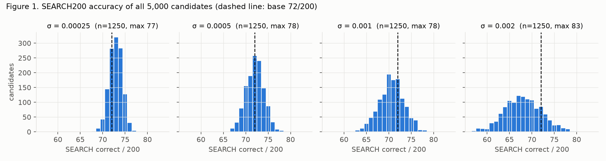
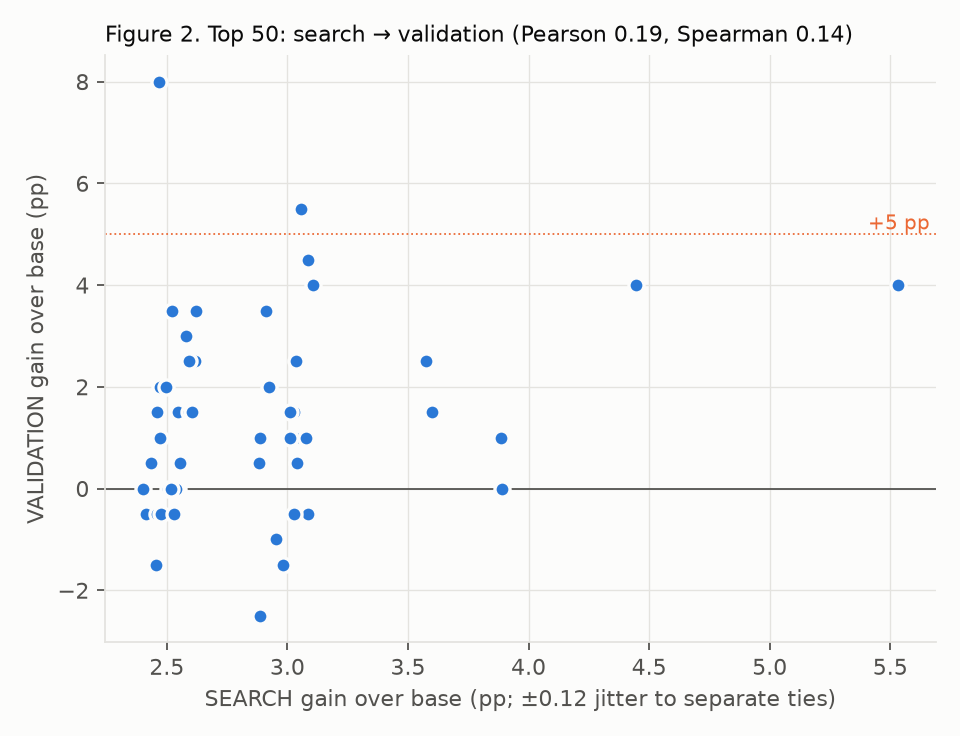
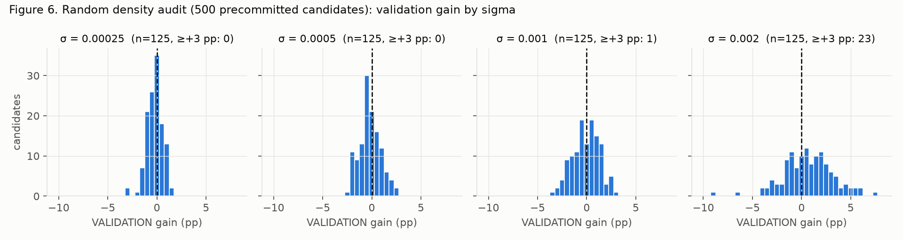
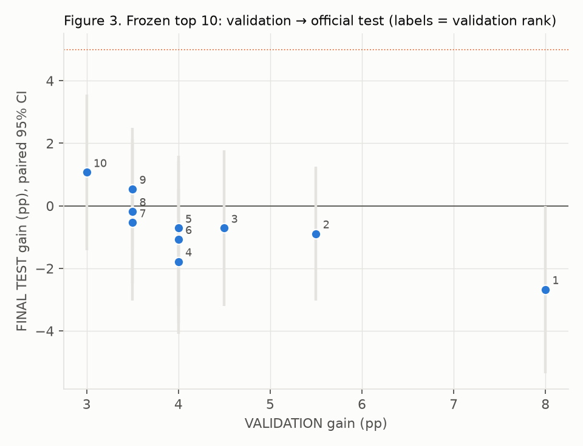
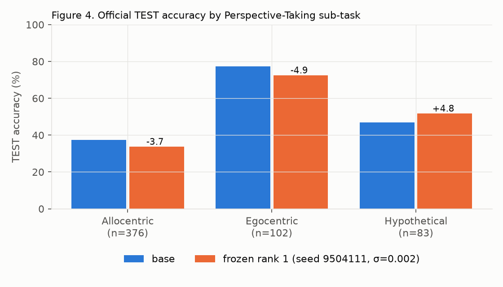
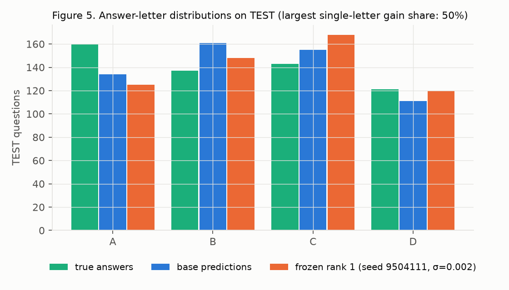

# Perspective-Taking Visual Neural Thickets, N = 5,000: result

| Metric | Result |
|---|---:|
| Model | Qwen3-VL-8B-Instruct |
| Candidates | 5,000 |
| Search examples | 200 |
| K validated | 50 (plus 500-candidate random density audit) |
| Validation examples | 200 |
| Final test | Full official Perspective-Taking test (561) |
| Base final-test accuracy | 46.17% (259/561) |
| Best search gain | +5.5 pp (83/200, seed 9502763, σ=0.002) |
| Best validation gain | +8.0 pp (95/200, seed 9504111, σ=0.002) |
| Frozen rank-1 test gain | **−2.67 pp** (244/561), 95% CI [−5.35, 0.00] |
| Best frozen top-10 test gain | +1.07 pp (validation rank 10) |
| Top-10 test ≥ +3 pp | 0 / 10 |
| Top-10 test ≥ +5 pp | 0 / 10 |
| Genuine expert found? | **No** |
| Final decision | **`NO_GO_VISUAL_NEURAL_THICKET_PERSPECTIVE_N5000`** |

All 5,000 candidates, the top-50 validation and the frozen top-10 official test
completed with every runtime control passing. Neither the primary nor the
replicated GO criterion holds, so this is a full-scale negative. Per the
protocol, the existence phase stops here, with no rescue.

## 1. Did the 5,000-candidate population produce a strong search right tail?

**A thin one.** On SEARCH200 the base scores 72/200 (36.0%).

| Population | Value |
|---|---:|
| Mean / median / SD | 70.9 / 72 / 3.34 |
| Range | 57–83 |
| 5 / 25 / 50 / 75 / 95 / 99% quantiles | 64 / 69 / 72 / 73 / 75 / 77 |
| Candidates above base | 1,759 |
| Search gain ≥ +1 / +3 / +5 pp | 1,025 / 25 / 1 |

| σ | Mean | SD | Max | > base | ≥ +3 pp | ≥ +5 pp |
|---:|---:|---:|---:|---:|---:|---:|
| 0.00025 | 72.9 | 1.45 | 77 | 766 | 0 | 0 |
| 0.0005 | 72.1 | 1.98 | 78 | 522 | 4 | 0 |
| 0.001 | 70.6 | 2.80 | 78 | 297 | 5 | 0 |
| 0.002 | 68.0 | 4.13 | 83 | 174 | 16 | 1 |

Larger σ lowers the mean and widens the spread, so the extreme right tail comes
from σ = 0.002. The top 50 by sigma were 27 at σ = 0.002, 11 at 0.001, 12 at
0.0005 and none at 0.00025. These are search statistics only, not expert
density. On 200 questions, a 2.5–5.5 pp right tail across 5,000 draws is close to
what selection noise produces from a population with SD ≈ 1.5–4 correct answers.

## 2. Did those winners survive independent validation?

**Partly, but weakly selected, and with a split-specific signal.** Validation
base is 79/200 (39.5%).

| Frozen top 50 on VALIDATION200 | Value |
|---|---:|
| Above base | 34 / 50 |
| ≥ +1 / +3 / +5 pp | 30 / 10 / 2 |
| Search-gain → validation-gain correlation | Pearson 0.19, Spearman 0.14 |
| Search top 10 still in validation top 10 | 3 of 10 |

The search winner (+5.5 pp) fell to +4.0 pp on validation. The validation
winner, seed 9504111 (search rank in the 77-correct tie group), reached **+8.0 pp**
(95/200, paired 95% CI [+3.5, +13.0]). Its gains were spread across letters,
with the largest single-letter share 0.38.

The **precommitted random density audit** shows that a validation gain at
σ = 0.002 does not require search selection. Of 125 random σ = 0.002
candidates:

- **60** reached ≥ +1 pp (Wilson 95% CI 39–57%);
- **23** reached ≥ +3 pp (13–26%);
- **7** reached ≥ +5 pp (3–11%).

At smaller sigmas almost nothing passes +3 pp (0, 0 and 1 of 125). Yet the same
σ = 0.002 population averages −4 correct on SEARCH200. A broad shift that helps
VALIDATION200 but hurts SEARCH200 is a split-specific interaction, not a
transferable skill. Its fate on test (below) confirms that reading.

## 3. Did frozen validation winners survive the official final test?

**No.** On the 561-question official test, the base scores 259 (46.17%). The
validation top 10 collapsed to the base level or below.

| Val rank | Seed | σ | Val gain | Test correct | Test gain | Paired 95% CI | Wins / losses | McNemar p |
|---:|---:|---:|---:|---:|---:|---|---:|---:|
| 1 | 9504111 | 0.002 | +8.0 | 244 | **−2.67** | [−5.35, 0.00] | 23 / 38 | 0.072 |
| 2 | 9500931 | 0.002 | +5.5 | 254 | −0.89 | [−3.03, +1.25] | 16 / 21 | 0.51 |
| 3 | 9504875 | 0.002 | +4.5 | 255 | −0.71 | [−3.21, +1.78] | 23 / 27 | 0.67 |
| 4 | 9502763 | 0.002 | +4.0 | 249 | −1.78 | [−4.10, +0.53] | 17 / 27 | 0.17 |
| 5 | 9502699 | 0.002 | +4.0 | 255 | −0.71 | [−3.21, +1.60] | 22 / 26 | 0.67 |
| 6 | 9500875 | 0.002 | +4.0 | 253 | −1.07 | [−3.74, +1.43] | 25 / 31 | 0.50 |
| 7 | 9501027 | 0.002 | +3.5 | 256 | −0.53 | [−3.03, +1.96] | 24 / 27 | 0.78 |
| 8 | 9501594 | 0.001 | +3.5 | 258 | −0.18 | [−2.50, +2.14] | 21 / 22 | 1.00 |
| 9 | 9502542 | 0.001 | +3.5 | 262 | +0.53 | [−1.43, +2.50] | 16 / 13 | 0.71 |
| 10 | 9501287 | 0.002 | +3.0 | 265 | +1.07 | [−1.43, +3.57] | 28 / 22 | 0.48 |

Across the top 10:

- **Distribution:** the mean test gain was −0.70 pp, and 2 of 10 scored above
  base.
- **Expert checks:** none passed the +5 pp, bootstrap or two-sub-task checks.
- **Validation as a predictor:** the larger the validation gain, the worse the
  test result tended to be. Rank 1, with the largest validation gain, had the
  largest test loss.

## 4. Did we find a genuine ≥ +5 pp Perspective-Taking expert?

**No.** No frozen candidate reached +5 pp, and none even reached +3 pp. Rank 1
failed every substantive check:

- **gain:** −2.67 pp;
- **paired bootstrap 95% lower bound:** −5.35 pp, not above 0;
- **sub-tasks:** only one of three improved.

The replicated route also fails, on all four conditions:

- ≥ 3 candidates at +3 pp: 0 of 10 qualify.
- A candidate at +5 pp: none qualifies.
- Top-10 mean ≥ +3 pp: the mean is −0.70 pp.
- A +5 pp candidate passing the expert checks: none exists.

## 5. Was the improvement broad across perspective-taking skills?

There was no aggregate improvement to be broad. Rank 1 traded sub-tasks
(Figure 4):

| Rank 1 vs base on TEST | Base | Rank 1 | Change |
|---|---:|---:|---:|
| Allocentric (n=376) | 37.5% | 33.8% | −3.7 pp |
| Egocentric (n=102) | 77.5% | 72.5% | −4.9 pp |
| Hypothetical (n=83) | 47.0% | 51.8% | +4.8 pp |

Hypothetical gains appear in several top-10 candidates (up to +7.2 pp for
rank 10). On only 83 questions, however, these are not distinguishable from noise,
and they come with egocentric losses in 8 of 10 candidates.

## 6. Was it genuine improvement rather than answer-choice redistribution?

**Neither.** There was no genuine improvement on test, and the frozen top 10 do
show answer redistribution:

- **Rank 1:** shifted predictions toward C (155 → 168) and away from B and A.
- **Letter-concentration rule on test:** five candidates fail it outright
  (validation ranks 3, 4, 5, 6 and 7, at shares 0.89–1.0). Those candidates had
  only a few positive net gains, all on a single letter.
- **Validation:** gains passed the spread rule. The density audit indicates that
  σ = 0.002 broadly shifts answer preferences in a way that happened to favour
  VALIDATION200's answer mix. The validation base over-predicts B (73 vs 56
  true).

## 7. Which sigma produced the strongest transferable candidates?

**None transferred.** Every frozen top-10 candidate came from σ = 0.002 (8) or
σ = 0.001 (2). σ = 0.002 owned the search tail, the validation tail and the
random validation-level density. On test, all eight σ = 0.002 candidates except
rank 10 scored at or below base. The two σ = 0.001 candidates were within ±0.6 pp
of base.

## 8. Did the ensemble improve beyond individual experts?

**No.** Majority votes did not beat the base, let alone the +7 pp secondary
mark.

| Ensemble | Test correct | Gain | Paired 95% CI |
|---|---:|---:|---|
| Top-5 majority vote | 256 | −0.53 pp | [−2.50, +1.43] |
| Top-10 majority vote | 255 | −0.71 pp | [−2.67, +1.25] |

## 9. Final GO / NO-GO

**`NO_GO_VISUAL_NEURAL_THICKET_PERSPECTIVE_N5000`.**

At full Neural-Thickets/RandOpt scale, vanilla RandOpt did not find a nearby
Qwen3-VL-8B model with materially and transferably stronger visual
perspective-taking:

- The search right tail and the validation winners were real only on their own
  200-question splits.
- The strongest validation signal was a broad σ = 0.002 effect that did not
  carry to the official test.

This is a scientific negative, separate from operations: all controls passed.
Per the protocol, none of the following were tried: N = 10,000, new sigmas,
another model or subset, prompt changes, BO, CMA-ES, modular-norm RandOpt,
transfer-aware ranking or localization.

## Base model reference (fixed, never used for selection)

| Split | Accuracy | Allocentric | Egocentric | Hypothetical | Invalid |
|---|---:|---:|---:|---:|---:|
| SEARCH200 | 36.0% | 33.8% | 38.7% | 25.0% | 0 |
| VALIDATION200 | 39.5% | 30.8% | 47.1% | 18.8% | 0 |
| TEST561 | 46.2% | 37.5% | 77.5% | 47.0% | 0 |

Full confusion matrices, prediction marginals and per-letter gains for every
validated and tested candidate are in the
[validation lock](../results/perspective-taking-n5000-20261004/locks/validation.json)
and [analysis](../results/perspective-taking-n5000-20261004/analysis/).

## Integrity and controls

**Freeze points.**

| Item | Commit | Committed (UTC) | Notes |
|---|---|---|---|
| Dataset | `faf8f54` | Oct 4 | |
| Protocol | `e5bb2ce` | Oct 4 | before any Qwen3-VL inference |
| Baseline lock | `833e445` | 18:05:31 | |
| Search lock (5,000 ranking + top 50) | `220ba16` | 03:55:03 | validation started 03:55:05 |
| Validation lock (rank 1 / top 5 / top 10) | `f0c3cf6` | 04:47:36 | test started 04:47:37.6 |

All 67 lock-before-phase checks pass.

**Controls, all passing.** Every shard and phase:

- **Zero perturbation and repeat:** zero perturbation reproduced the committed
  base outputs exactly, and the first candidate's repeat gave identical state and
  outputs.
- **Restoration:** every reset was bitwise exact.
- **Encoding:** images were freshly encoded with unique UUIDs and the encoder
  cache cleared.
- **Preprocessing:** per-image RGB pixel and prompt hashes matched the baseline.
- **Fingerprints:** all 5,000 search fingerprints are distinct, and
  validation/test candidates matched their search fingerprints before
  generation.
- **Fast-control proof:** the baseline phase proved the fast GPU drift check and
  tree fingerprint equal to the originals on base and on a perturbed state.

**Independent reproduction.**
[`scripts/verify_perspective.py`](../scripts/verify_perspective.py) re-audits
every phase locally from raw generations. It reproduces all 5,000 search
records, the top 50, the validation top 10, all 543 validated candidates (top 50
plus 493 non-overlapping audit candidates) and the final decision.

**Population checks.** 5,000 unique candidates, 1,250 per sigma, no missing or
duplicate manifest index.

**Software.** `Qwen/Qwen3-VL-8B-Instruct@0c351dd`, BF16, TP=1, greedy decoding,
vLLM 0.11.0, transformers 4.57.1, torch 2.8.0+cu128, unchanged RandOpt worker
`4000d34`, on 8× H100 80GB.

## Operational notes (none affect the scientific result)

1. **Two transport failures before any search shard completed.**
   - **Cause:** vLLM's Ray executor retained about 0.86 GB of multimodal tensors
     per generation call, which spilled the Ray object store to disk.
   - **First attempt:** died with `OutOfDiskError`.
   - **Interim fixes:** an actor image cache and a larger object store reduced
     the leak but did not remove it.
   - **Final fix (`e67c9a7`):** each GPU process runs vLLM in-process (`uni`
     executor) with the same pinned RandOpt worker extension.
   - **Equivalence evidence:** for the same candidates, outputs and state
     fingerprints were identical across transport changes. That was 40 of 40
     before and after the image cache, and 256 of 256 between the in-process
     engine and the Ray executor. Every shard's zero control also had to
     reproduce the committed baseline outputs.
   - **Disposition:** interrupted shards were rerun from scratch, and no partial
     shard counts.
2. **Lost failure records.** The interrupted-attempt directories (`.failed-N`)
   and per-GPU orchestrator logs were lost when the pod stopped, seconds before a
   final pull. They were never part of the scientific record. All complete phase
   directories, locks and the analysis were retrieved first.
3. **Idle tail.** Round-robin shard assignment left shards 48–49 as a 7th round
   on GPUs 0–1, idling six GPUs for about an hour.
4. **Cost.**

   | Item | H100-hours |
   |---|---:|
   | Billed (8 GPUs × ~11.5 h, 17:40–05:10 UTC, including setup and idle) | about 92 |
   | Lost to the two transport failures | about 12 |
   | Idle tail on six GPUs | about 6 |

   The pod was stopped automatically right after final retrieval.

[Protocol](PERSPECTIVE_TAKING_N5000_PROTOCOL.md) ·
[evidence](../results/perspective-taking-n5000-20261004/) ·
[figures](../results/perspective-taking-n5000-20261004/figures/)
