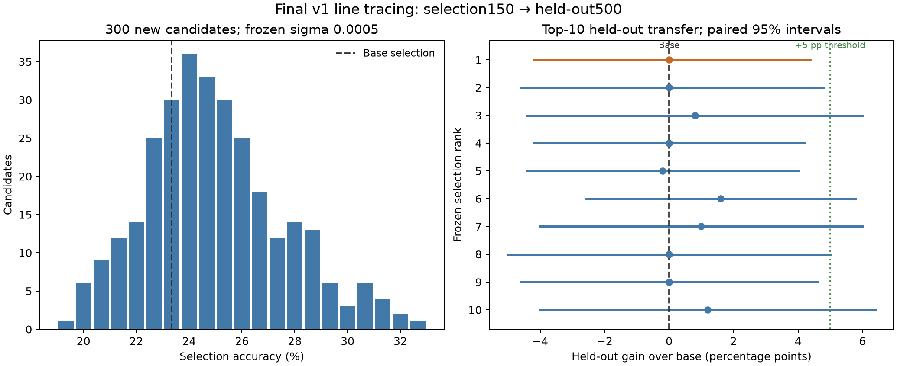

# Final Visual Neural Thickets line-tracing experiment — 2026-10-03

| Metric | Result |
|---|---:|
| Base held-out | 26.60% (133/500) |
| Best calibration candidate held-out | 27.60% (138/500), +1.00 pp |
| Final rank-1 selection | 32.67% (49/150) |
| Final rank-1 held-out | 26.60% (133/500) |
| Rank-1 held-out gain | **0.00 pp** |
| Top-10 candidates > base | 4/10 |
| Top-10 ≥ +1 pp | 3/10 |
| Top-10 ≥ +3 pp | 0/10 |
| Top-10 ≥ +5 pp | 0/10 |
| Top-5 ensemble | 25.40% (127/500), −1.20 pp |
| Top-10 ensemble | 27.80% (139/500), +1.20 pp |
| Final decision | **NO-GO** |

**1. Did the existing +10 pp calibration candidate transfer?**

Only a small point-estimate gain transferred. The exact existing candidate,
seed 3100000 at sigma 0.0005, scored 138/500 versus base 133/500: **+1.00 pp**,
with paired bootstrap 95% interval **[−4.20, +6.20] pp** and exact two-sided
McNemar p=0.7598. Its 50/150 selection score had been +10 pp over base 35/150.
The held-out result was diagnostic only and did not affect search or selection.

**2. What is the 300-candidate selection distribution?**

All 300 fresh seeds, 6100000–6100299, ran at the frozen sigma **0.0005** on all
150 original v1 selection images. Accuracy ranged from **19.33% to 32.67%**;
mean was **24.96%**, median **24.67%**, and sample standard deviation **2.61 pp**.
203/300 (67.67%) beat the selection base; 167/300, 79/300 and 35/300 exceeded it
by at least 1, 3 and 5 pp, respectively. These are descriptive selection results.
No population mean, base-accuracy, or diagnostic-score gate stopped the run.
The complete histogram is in [distribution.json](../results/visual-line-tracing-final-20261003/analysis/distribution.json).

**3. Did the frozen rank-1 candidate improve held-out by ≥5 pp?**

**No.** Seed **6100249** was selected solely by 49/150 correct, followed by the
predeclared candidate-ID hash tie-break. Its held-out score was **133/500**, equal
to base. The required +5 pp threshold was 158/500. The full 300-candidate ranking,
rank-1, top-5/top-10 identities, scores and state fingerprints were
[committed before held-out inference](../results/visual-line-tracing-final-20261003/locks/selection.json).

**4. Did multiple top candidates individually transfer?**

Four had positive point-estimate gains, three reached +1 pp, and none reached
+3 or +5 pp. The highest held-out score among the frozen ten was rank 6:
**141/500 (28.20%), +1.60 pp**. This does not replace the frozen primary rank-1.
Mean top-10 individual accuracy was **27.04% (+0.44 pp)**; top-5 mean was
**26.72% (+0.12 pp)**. All three replication conditions failed. These experts
share selection and held-out examples and are not independent replication cohorts.

| Frozen rank | Seed | Selection /150 | Held-out /500 | Held-out accuracy | Gain (pp) | Candidate-only / base-only correct |
|---|---:|---:|---:|---:|---:|---:|
| 1 | 6100249 | 49 | 133 | 26.60% | 0.00 | 59 / 59 |
| 2 | 6100285 | 48 | 133 | 26.60% | 0.00 | 71 / 71 |
| 3 | 6100011 | 48 | 137 | 27.40% | +0.80 | 87 / 83 |
| 4 | 6100154 | 47 | 133 | 26.60% | 0.00 | 57 / 57 |
| 5 | 6100028 | 47 | 132 | 26.40% | −0.20 | 57 / 58 |
| 6 | 6100033 | 47 | 141 | 28.20% | +1.60 | 60 / 52 |
| 7 | 6100089 | 47 | 138 | 27.60% | +1.00 | 83 / 78 |
| 8 | 6100215 | 46 | 133 | 26.60% | 0.00 | 77 / 77 |
| 9 | 6100035 | 46 | 133 | 26.60% | 0.00 | 70 / 70 |
| 10 | 6100038 | 46 | 139 | 27.80% | +1.20 | 90 / 84 |

**5. Is there a genuine held-out right tail around the VLM?**

This experiment found **no convincing material held-out right tail** among the
frozen selected candidates. Selection gains did not produce any ≥3 pp held-out
expert, and every individual paired interval included zero. The selected ten
are an enriched sample, so their frequencies do not estimate unbiased expert
density throughout the weight neighborhood. The finite budget does not prove
that no better model exists anywhere in that neighborhood.

Top-5 voting scored **25.40%**, with paired gain interval **[−5.60, +3.20] pp**;
top-10 voting scored **27.80%**, interval **[−3.40, +6.00] pp**. Neither achieved
the additional +7 pp ensemble threshold; ensemble performance is not a GO route.

Orange marks the frozen primary rank-1. Intervals are paired 95% percentile
bootstrap intervals; secondary comparisons are descriptive and unadjusted.

**6. Are gains spread across visual difficulty levels?**

All ten improved Easy and Medium and regressed on Hard. Rank-1 gained **+5.39 pp
on Easy** and **+0.60 pp on Medium**, while losing **−6.02 pp on Hard**. Its two-level
improvement condition passed, but its aggregate gain was zero.

| Method | Easy (167) | Medium (167) | Hard (166) |
|---|---:|---:|---:|
| Base | 26.95% | 26.35% | 26.51% |
| Rank 1 | 32.34% | 26.95% | 20.48% |
| Rank 2 | 32.93% | 28.14% | 18.67% |
| Rank 3 | 31.14% | 27.54% | 23.49% |
| Rank 4 | 31.14% | 28.14% | 20.48% |
| Rank 5 | 32.34% | 26.95% | 19.88% |
| Rank 6 | 34.73% | 28.74% | 21.08% |
| Rank 7 | 32.34% | 28.14% | 22.29% |
| Rank 8 | 30.54% | 28.14% | 21.08% |
| Rank 9 | 30.54% | 26.95% | 22.29% |
| Rank 10 | 28.74% | 30.54% | 24.10% |

Per-true-answer-label accuracies show substantial redistribution across labels:

| Method | Label 1 (126) | Label 2 (122) | Label 3 (124) | Label 4 (128) |
|---|---:|---:|---:|---:|
| Base | 0.00% | 56.56% | 37.10% | 14.06% |
| Rank 1 | 0.00% | 22.13% | 32.26% | 51.56% |
| Rank 2 | 0.00% | 16.39% | 25.81% | 63.28% |
| Rank 3 | 0.79% | 14.75% | 14.52% | 78.12% |
| Rank 4 | 3.17% | 13.93% | 65.32% | 24.22% |
| Rank 5 | 0.00% | 14.75% | 48.39% | 42.19% |
| Rank 6 | 0.00% | 21.31% | 50.81% | 40.62% |
| Rank 7 | 0.00% | 12.30% | 23.39% | 73.44% |
| Rank 8 | 3.17% | 14.75% | 20.97% | 66.41% |
| Rank 9 | 0.00% | 21.31% | 19.35% | 64.84% |
| Rank 10 | 0.00% | 14.75% | 11.29% | 83.59% |

Rank-1 gained 48 correct label-4 answers, exactly offset by 42 fewer correct
label-2 answers and six fewer label-3 answers. All positive per-label net gains
were on label 4 (**100%**, failing the frozen <80% concentration requirement).
Label-4 predictions rose from 39 to 231; neither base nor rank-1 answered any
true-label-1 example correctly. This is an observed output redistribution, not
evidence of improved tracing. Complete confusion matrices, prediction marginals,
counts and paired statistics for every selected candidate are preserved in
[individual_experts.json](../results/visual-line-tracing-final-20261003/analysis/individual_experts.json).

**7. Is the improvement statistically paired-consistent?**

**No.** Rank-1 had **59 candidate-only correct**, **59 base-only correct**,
**74 both correct**, and **308 both wrong**. Its paired difference was 0.00 pp,
the 10,000-resample paired 95% interval was **[−4.20, +4.40] pp**, and exact
two-sided McNemar **p=1.0000**. The interval contains zero; no point-estimate
effect-size gain occurred. Every top-10 interval includes zero. The fixed seed
was 20261003, with common question resampling and percentile intervals.
[All individual intervals and wins/losses](../results/visual-line-tracing-final-20261003/analysis/tables.md)
and [per-question vectors](../results/visual-line-tracing-final-20261003/analysis/per_question.json.gz)
are available. Secondary intervals and p-values are unadjusted; they do not
replace the predefined effect-size criteria.

**8. Final decision: GO or NO-GO?**

**`NO_GO_VISUAL_THICKET_LINE_TRACING`.** The full 300-candidate search and frozen
top-10 held-out evaluation completed correctly. Primary effect size, positive
bootstrap lower bound and label-spread requirements failed; all replication
conditions failed. This is a scientific negative under the specified
model/task/search budget, with **no operational failure**. Close this vanilla
RandOpt line-tracing direction as requested. No additional candidates, sigmas,
models, prompts, geometry, benchmark versions or optimizers were tried.

The [protocol](VISUAL_LINE_TRACING_FINAL_PROTOCOL.md) and sigma lock were committed
as `ba6f7f554af92435e185dceae0ca2cbf3913cd37` at **21:32 EDT**, before any new
outputs. Ranking commit `da0d6eb8e9d537f93658d26ca279082d35fbbff6` was created at
**23:14:46 EDT**, before the held-out phase started at **23:14:47.535 EDT**.
The GPU phases ran **21:34–23:21 EDT on October 3**; raw manifests use October 4
UTC. The model remained
`Qwen/Qwen2.5-VL-3B-Instruct@66285546d2b821cf421d4f5eb2576359d3770cd3`, using
BF16, TP1, greedy decoding, the original RandOpt worker at
`4000d34fb5b69a3121cf1d2c564aa0be5a6a41ca`, and unchanged vLLM 0.10.2/Ray 2.49.2.

All **300 search fingerprints were distinct**. Selected fingerprints matched
before held-out generation; zero perturbation reproduced the committed base;
search and rank-1 repeats reproduced state and outputs; every snapshot reset
was bitwise exact; every image was freshly encoded. Both CPU and H100 test runs
passed **118 tests**, with one environment-appropriate skip each. All 654 v1
dataset files match their frozen commit, and selection/held-out IDs, seeds and
image hashes remain disjoint. The exact request count was **51,800**: 45,000
search, 5,000 selected held-out, 500 diagnostic and 1,300 predefined control
requests. There was no new baseline or sigma sweep.

[Independent local reproduction](../results/visual-line-tracing-final-20261003/independent-reproduction.json)
reproduced the raw-output scores, all derived outcomes, the decision and identical
bootstrap sample indices. [Evidence](../results/visual-line-tracing-final-20261003/)
includes raw generations, every recipe and fingerprint, exact commands, package
versions, GPU details and peaks, source snapshots and locks. The
[integrity record](../results/visual-line-tracing-final-20261003/integrity.json)
verifies preservation of prior artifacts and execution-source bytes. All prior
v1/v2/v2.1 artifacts and `main` are unchanged. The H100 was idle after cleanup.
